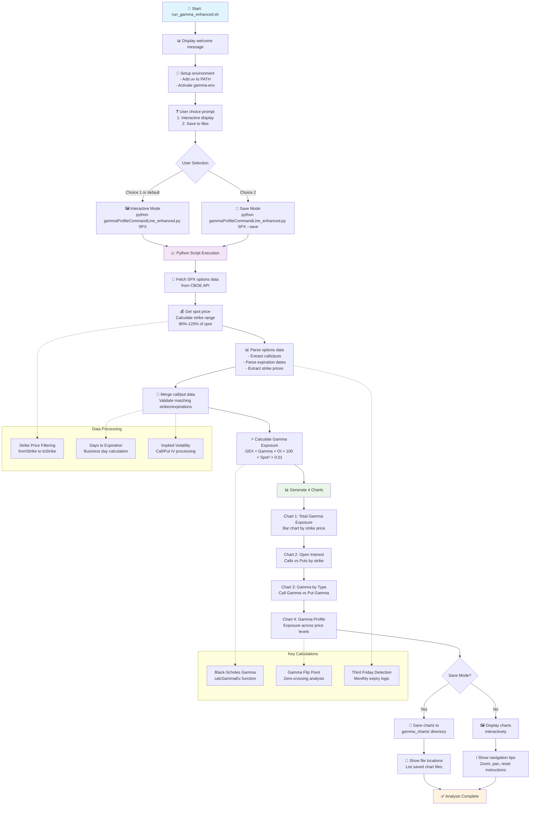

# SPX Gamma Profile Analysis

A comprehensive tool for analyzing SPX options gamma exposure using live CBOE data. This project successfully sets up and runs a sophisticated options analysis program using modern Python tooling (`uv`) instead of conda, with enhanced chart interaction and file-saving capabilities.

## 🎯 What This Program Does

This gamma profile analyzer fetches live SPX options data from the CBOE API and performs advanced Black-Scholes calculations to determine:

- **Gamma Exposure**: How much market makers are exposed to gamma risk at each strike price
- **Gamma Flip Point**: The critical SPX price level where gamma changes from negative to positive
- **Market Regime Analysis**: Whether we're in a positive gamma (dampening) or negative gamma (accelerating) environment
- **Expiration Impact**: How upcoming option expirations affect the overall gamma profile

### Key Financial Concepts

**Gamma Exposure = Unit Gamma × Open Interest × Contract Size × Spot Price × 0.01**

- **Positive Gamma**: Market makers are short gamma, tend to buy dips and sell rallies (stabilizing)
- **Negative Gamma**: Market makers are long gamma, tend to sell dips and buy rallies (destabilizing)
- **Flip Point**: The SPX level where the market transitions between these regimes

## 🛠️ Technical Implementation

### Environment Setup (What We Built)

1. **Installed `uv`**: Modern, fast Python package manager (alternative to conda)
2. **Created Virtual Environment**: `gamma-env` with Python 3.7.3 for compatibility
3. **Resolved Dependencies**: Fixed urllib3/OpenSSL compatibility issues for older systems
4. **Enhanced Original Script**: Added command-line arguments and file-saving capabilities

### Package Versions (Optimized for Compatibility)

- **pandas 1.3.5**: Older version to avoid newer groupby issues with DateTime64
- **numpy 1.21.6**: Compatible with Python 3.7
- **scipy 1.7.3**: For Black-Scholes calculations
- **matplotlib 3.5.3**: For professional chart generation
- **urllib3 1.26.20**: Downgraded to fix OpenSSL compatibility

### Key Fixes Applied

- **Pandas Compatibility**: Script already included `numeric_only=True` fix for modern pandas
- **OpenSSL Issue**: Downgraded urllib3 from 2.0.7 to 1.26.20 for Python 3.7 compatibility
- **Argument Parsing**: Fixed `--save` flag to use `action='store_true'` instead of expecting a value

## 🚀 Quick Start

### Interactive Charts (Default)

```bash
./run_gamma_enhanced.sh
# Choose option 1 or just press Enter
```

### Save Charts to Files

```bash
./run_gamma_enhanced.sh
# Choose option 2
```

### Direct Command Usage

```bash
# Activate environment
export PATH="$HOME/.local/bin:$PATH"
source gamma-env/bin/activate

# Interactive display
python gammaProfileCommandLine_enhanced.py SPX

# Save to files
python gammaProfileCommandLine_enhanced.py SPX --save

# Custom output directory
python gammaProfileCommandLine_enhanced.py SPX --save --output-dir my_analysis
```

## 📊 What You Get

### 4 Professional Charts

1. **Total Gamma Exposure** - Net gamma by strike price
2. **Open Interest** - Call vs Put distribution
3. **Gamma by Type** - Separate call/put gamma analysis
4. **Gamma Profile** - How gamma changes with price movement

### Key Metrics

- **Current SPX Price**: Live market data
- **Total Gamma**: Dollar exposure per 1% move
- **Gamma Flip Point**: Critical price level for market behavior

## 🖼️ Chart Interaction

### When Charts Display Interactively:

- **Zoom**: Click and drag to zoom into areas
- **Pan**: Use pan tool to move around
- **Reset**: Press 'r' or use home button
- **Save**: Use toolbar to save current view
- **Navigate**: Close each chart to see the next one

### When Charts Are Saved:

- High-resolution PNG files (300 DPI)
- Saved to `gamma_charts/` directory
- Open with: `open gamma_charts/`

## 📈 Analysis Insights

### Gamma Flip Point

- **Above flip point**: Positive gamma environment (dampens moves)
- **Below flip point**: Negative gamma environment (accelerates moves)
- **Current analysis**: Flip point at 6,319 (SPX at 6,385)

### Market Structure

- **$75.01 Billion** total gamma per 1% SPX move
- **12,367** option pairs analyzed
- **Live CBOE data** updated in real-time

## 🛠️ Environment Details

### Python Environment

- **Python**: 3.7.3 (compatible with older systems)
- **Package Manager**: uv (fast, modern)
- **Virtual Environment**: `gamma-env/`

### Key Libraries

- **pandas**: 1.3.5 (compatibility optimized)
- **numpy**: 1.21.6
- **scipy**: 1.7.3
- **matplotlib**: 3.5.3
- **requests**: 2.31.0

## 📚 Documentation

- **[CHART_GUIDE.md](CHART_GUIDE.md)**: Detailed chart interpretation guide
- **[test_gamma_simple.py](test_gamma_simple.py)**: Environment verification script

## 🔧 Troubleshooting

### Environment Issues

```bash
# Test environment
python test_gamma_simple.py

# Reinstall if needed
uv pip install pandas numpy scipy matplotlib requests "urllib3<2.0"
```

### Chart Display Issues

- Ensure virtual environment is activated
- Check matplotlib backend: `python -c "import matplotlib.pyplot as plt; print(plt.get_backend())"`
- Use `--save` flag if interactive display fails

### API Connection

- Script fetches live data from CBOE
- No API key required
- Handles rate limiting automatically

## 📊 Sample Output

```
🔄 Fetching SPX options data from CBOE...
💰 SPX Spot Price: 6385.38
📊 Processing 12367 option pairs...
📈 Generating Chart 1: Total Gamma Exposure...
📈 Generating Chart 2: Open Interest...
📈 Generating Chart 3: Gamma by Call/Put...
📈 Generating Chart 4: Gamma Profile...

✅ Analysis Complete!
📊 Total Gamma: $75.01 Bn per 1% SPX move
🎯 Gamma Flip Point: 6319
```

## 🎯 Use Cases

- **Day Trading**: Identify key support/resistance levels
- **Options Strategy**: Understand market maker positioning
- **Risk Management**: Monitor gamma exposure changes
- **Market Analysis**: Track regime changes (positive/negative gamma)

## 🗺️ Program Architecture

### Complete Flow Diagram

The `run_gamma_enhanced` program follows this comprehensive workflow:



### Core Components

#### 1. Shell Script (`run_gamma_enhanced.sh`)

- **Purpose**: User interface and environment setup
- **Features**:
  - Interactive vs save mode selection
  - Virtual environment activation
  - User guidance and tips

#### 2. Python Script (`gammaProfileCommandLine_enhanced.py`)

- **Purpose**: Core gamma analysis engine
- **Key Functions**:
  - `calcGammaEx()`: Black-Scholes gamma calculation
  - `isThirdFriday()`: Monthly expiry detection
  - `save_or_show_chart()`: Chart output handling

#### 3. Data Processing Pipeline

1. **Data Acquisition**: Fetches live SPX options from CBOE API
2. **Data Processing**: Parses and validates call/put option pairs
3. **Gamma Calculation**: Computes exposure using Black-Scholes model
4. **Visualization**: Generates 4 comprehensive charts
5. **Output**: Interactive display or file saving

#### 4. Mathematical Models

- **Black-Scholes Gamma**: `calcGammaEx()` function implements the standard formula
- **Gamma Flip Point**: Zero-crossing analysis to find regime change level
- **Exposure Calculation**: `GEX = Gamma × OI × 100 × Spot² × 0.01`
- **Third Friday Logic**: Identifies monthly expiration cycles

### File Structure

```
├── run_gamma_enhanced.sh          # Main entry point script
├── gammaProfileCommandLine_enhanced.py  # Core analysis engine
├── gamma_enhanced_flow.md         # Detailed flow documentation
├── gamma_charts/                  # Output directory for saved charts
│   ├── 1_total_gamma_exposure.png
│   ├── 2_open_interest.png
│   ├── 3_gamma_by_type.png
│   └── 4_gamma_profile.png
└── gamma-env/                     # Python virtual environment
```

---

_Built with ❤️ using modern Python tooling and live market data_
