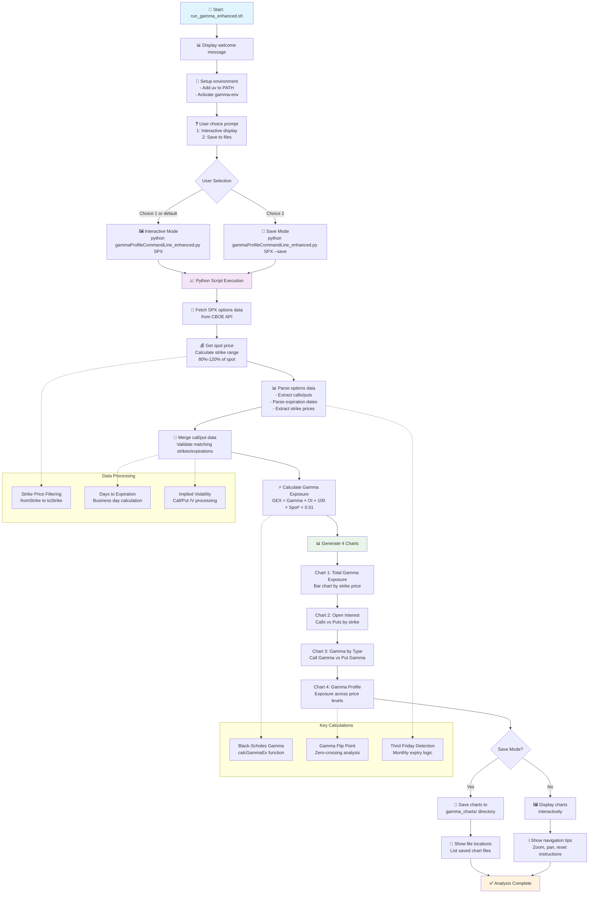

# Run Gamma Enhanced Program Flow

## Program Components

### 1. Shell Script (`run_gamma_enhanced.sh`)

- **Purpose**: User interface and environment setup
- **Features**:
  - Interactive vs save mode selection
  - Virtual environment activation
  - User guidance and tips

### 2. Python Script (`gammaProfileCommandLine_enhanced.py`)

- **Purpose**: Core gamma analysis engine
- **Key Functions**:
  - `calcGammaEx()`: Black-Scholes gamma calculation
  - `isThirdFriday()`: Monthly expiry detection
  - `save_or_show_chart()`: Chart output handling

### 3. Data Flow

1. **Data Acquisition**: Fetches live SPX options from CBOE API
2. **Data Processing**: Parses and validates call/put option pairs
3. **Gamma Calculation**: Computes exposure using Black-Scholes model
4. **Visualization**: Generates 4 comprehensive charts
5. **Output**: Interactive display or file saving

### 4. Chart Types Generated

- **Chart 1**: Total gamma exposure by strike price
- **Chart 2**: Open interest distribution (calls vs puts)
- **Chart 3**: Gamma exposure by option type
- **Chart 4**: Gamma profile across price levels with flip point

### 5. Key Metrics Calculated

- **Total Gamma Exposure**: Dollar impact per 1% index move
- **Gamma Flip Point**: Price level where gamma changes sign
- **Strike Range**: 80%-120% of current spot price
- **Expiration Analysis**: Current vs future expiries
